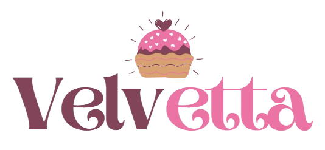

  

# 🍰 Velvetta Bakery

## 🧁 About The Project

Feeling stressed or unhappy? 🍰✨ With **Velvetta**, discover the perfect dessert to lift your mood. Explore pastries, view detailed product information, and enjoy a smooth, pastel-toned browsing experience.

## ✨ Features

* 🍰 Browse a variety of bakery products
* 🔍 Search, filter, and sort desserts
* 📄 Detailed product pages
* 💬 Add and view comments
* 🔐 Authentication system (Login / Register)
* 📱 Responsive design
* 🎨 Soft, modern pastel UI

## 🗂️ Pages

* 🏠 Home
* ℹ️ About
* 📞 Contact
* 🔐 Authentication (Login / Register)
* 🍪 Menu
* 📄 Product Detail
* ❌ Not Found

## 🛠️ Tech Stack

* ⚛️ React
* 🔄 React Router DOM
* 🔥 Firebase (Auth & Database)
* 🎨 CSS
* 🍭 SweetAlert2
* ⏳ React Loader Spinner
* 🎯 React Icons

## 🌐 Live Demo

https://velvetta.vercel.app/

## 🎯 Project Purpose

Velvetta is a front-end project developed during a development internship. The entire design, structure, and data were created from scratch by the developer, showcasing attention to detail and practical development skills. The project was completed within 10 days.

✨ *Velvetta is not just a bakery — it's a digital dessert experience.*
